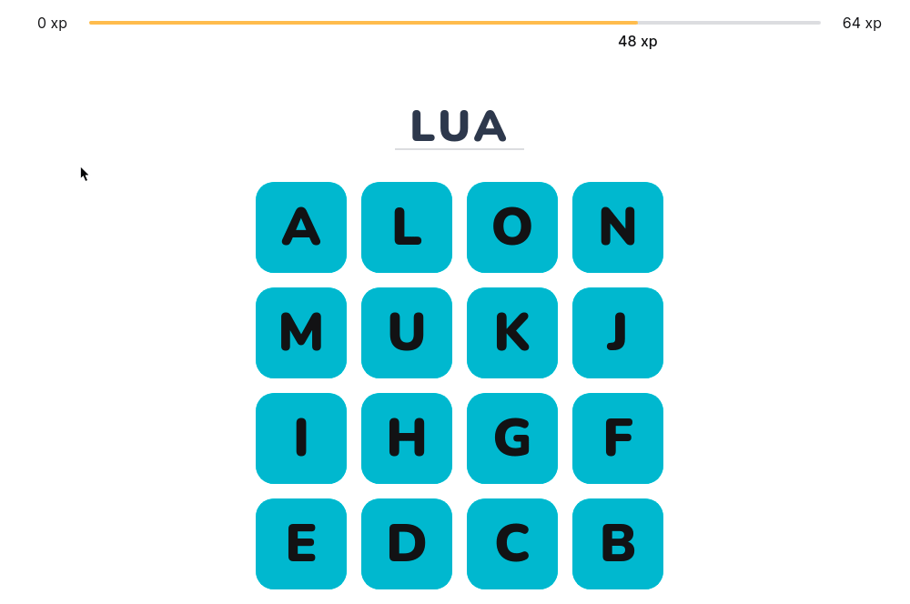

  

<h1 align="center">
  Words Game  
  <code>React Version</code>
</h1>

 Que tal aprender as letras do alfabeto jogando? 😉

## 🧠 Motivação

Jogos com Javascript mudaram minha jornada como desenvolvedor. Primeiro o [Simon Game](https://github.com/raphaeldevs/simon-game), depois o [Visual Memory](https://github.com/raphaeldevs/visual-memory) e por último o [Words Game JS](https://github.com/raphaeldevs/words-game-js), que agora estou refazendo com React e adicionando novas features.

A inspiração surgiu quando vi meu irmão de 7 anos voltar da escola. A minha ideia era fazer um jogo onde ele pudesse ter contato com as letras e formar palavras, mesmo sem ainda saber ler totalmente. Eu acredito que este jogo possar ajudar na familiarização com as letras do alfabeto.

## 🏗 Novas features
- Novo Layout e animações
- Sistema de level
- Em breve...

## 👨‍💻 Área técnica
Como o jogo está sendo feito com React, tive a oportunidade de aplicar features muito interessantes dessa tecnologia como a Context API.

### 💡 Aprendizados
- Casos de uso de contextos
- Configurar Sass e CSS Modules no Webpack
- Configurar SVGs